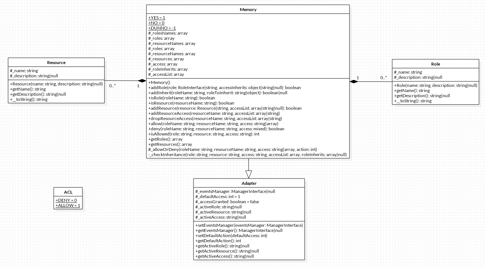

#ACL

##Kurzbeschreibung
Zugriffskontrolllisten (_Access Control Lists_) ermöglichen eine abstrahierte
Verwaltung von Rollen, Ressourcen und Berechtigungen.

##UML

##Klassen
* `Phalcon\Acl`
* `Phalcon\Acl\Adapter`
* `Phalcon\Acl\Exception`
* `Phalcon\Acl\Resource`
* `Phalcon\Acl\Role`
* `Phalcon\Acl\Adapter\Memory`

##Interfaces
* `Phalcon\Acl\AdapterInterface`
* `Phalcon\Acl\ResourceInterface`
* `Phalcon\Acl\RoleInterface`

##Bekannte Probleme
* Phalcon 0.5.3
	- [Fehler bei der Vererbung von Zugriffsrechten](https://github.com/phalcon/cphalcon/issues/65)
* Phalcon 1.0.0
	- [Illegal instruction in `Acl\Memory`](https://github.com/phalcon/cphalcon/commit/54085524876b17eca46083ac833c871a1d7b92c6)
* Phalcon 1.2.0
	- [Fehler bei Wildcard-Nutzung](https://github.com/phalcon/cphalcon/issues/759)
* Phalcon 1.2.4
	- [Segmentation Fault durch `dropResourceAccess`](https://github.com/phalcon/cphalcon/issues/1376)
	- [Zugriff auf gesperrte Ressourcen möglich](https://github.com/phalcon/cphalcon/issues/1303)
	- [Null-Pointer in `dropResourceAccess`](https://github.com/phalcon/cphalcon/commit/218af45edf327882efbff04b4acd1dd490ba0dfb)
* Phalcon 1.3.0
	- [Numerische Ressourcen sind unzulässig](https://github.com/phalcon/cphalcon/issues/1890)
* Phalcon 1.3.2
	- [Interner Fehler bei Variablenerzeugung](https://github.com/phalcon/cphalcon/pull/2421)
	- [Interner Fehler bei Variablenerzeugung](https://github.com/phalcon/cphalcon/issues/1258)
	- [Fehlerhafte Rollenvererbung](http://forum.phalconphp.com/discussion/103/acl-roles-inheritance)
	- [Segmentation Fault durch `role_adapter_memory_check_inheritance`](https://github.com/phalcon/cphalcon/commit/d7a92ebba53098865d7bfd1179d48e4ef456feb6)
	- [Speicherleck in `role_adapter_memory_check_inheritance`](https://github.com/phalcon/cphalcon/commit/005971b9556a7c799eb65582d6667f570682d592)
* Phalcon 2.0.0
	- [Verwendung von booleschen Werten statt numerischen für die Zugriffskonstanten](https://github.com/phalcon/cphalcon/pull/2500)
* Entwicklungsversion
	- [Wildcard-Fehler bei Rollen](https://github.com/phalcon/cphalcon/issues/2648)